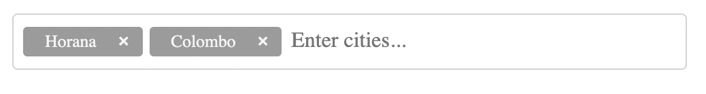

# Chip Inputs

## Installation
```shell
npm i chips-input-lib
```
## Usage
The component can be used as below.

- View


- Source
```js
import { ChipsInput } from 'chips-input-lib';


const onAddChips = (cities) => {
  console.log(cities);
};

function App() {
  return (
    <div className="App">
      <ChipsInput onAddChips={onAddChips} placeholder="Insert City"/>
    </div>
  );
}

export default App;

```

## Properties

| Name        | Type   | Default | Description                                                                        |
|-------------|--------|---------|------------------------------------------------------------------------------------|
| placeholder | string | empty   | Places holder of the text input.                                                  |
| onAddChips  | func   |         | A callback function type of `(texts) =>` that is called when a new chip was added. |
| chipBgColor  | string   |  #f5f5f5       | Background color of the chips. |
| chipColor  | string   |     #9b9b9b    | Font color of the chips. |

# License
The files included in this repository are licensed under the MIT license.